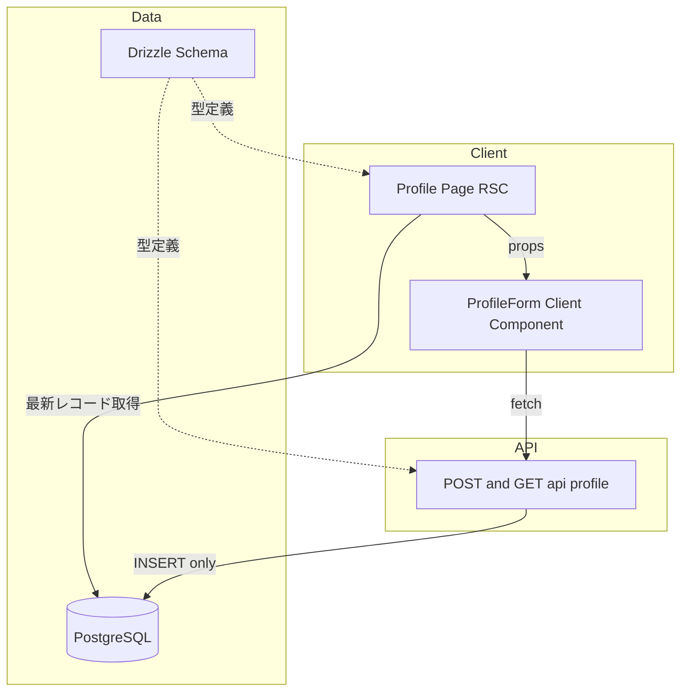
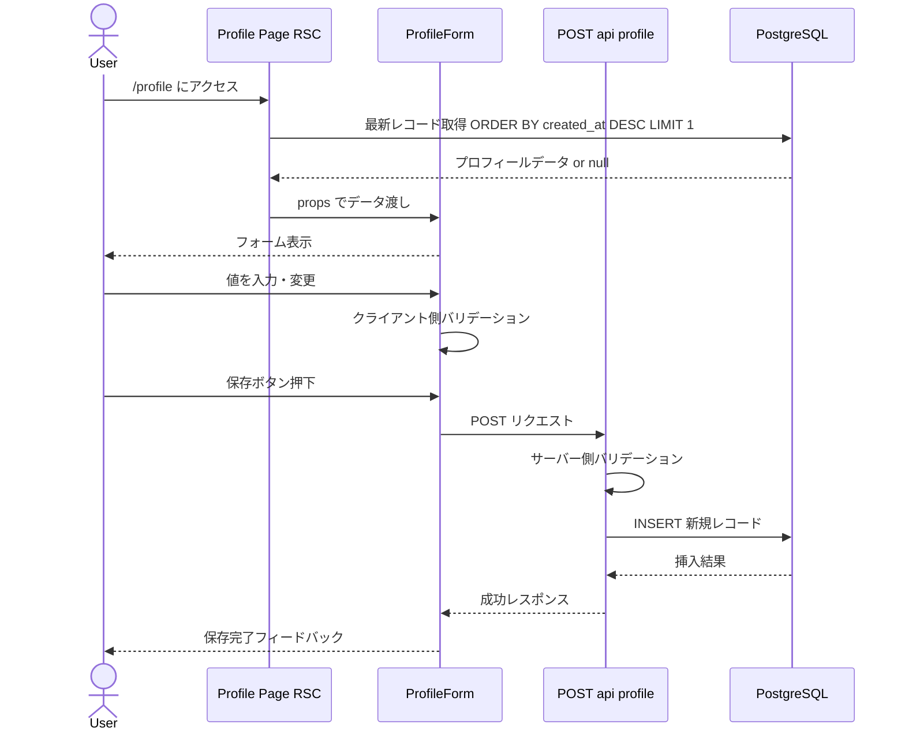

# Design Document: プロフィール管理

## Overview

**Purpose**: プロフィール管理機能は、ユーザーの個人財務情報（年収・貯蓄額・想定金利・返済期間・頭金割合）を登録・表示・編集する機能を提供する。このデータは物件評価における「資金適合性」カテゴリ（50%ウェイト）の基礎データとして使用される。

**Users**: 開発者自身（シングルユーザー）が物件評価の前提となる個人財務情報を管理するために利用する。

### Goals
- 5つの財務項目を1画面で登録・表示・編集できる
- 入力値の妥当性をリアルタイムに検証し、不正なデータの保存を防止する
- データを PostgreSQL に永続化し、再アクセス時に復元する

### Non-Goals
- マルチユーザー対応（認証・認可）
- 外部金融サービスとの連携
- 物件評価ロジックの実装（別機能）

## Architecture

### Architecture Pattern & Boundary Map



**Architecture Integration**:
- **Selected pattern**: Next.js App Router の Server Component + Client Component 分離パターン。データ取得は Server Component で直接 DB アクセスし、フォーム操作は Client Component で処理する
- **Data strategy**: イミュータブルデータパターン。UPDATE/DELETE を行わず、変更のたびに新しいレコードを INSERT する。最新の `created_at` を持つレコードが現在のプロフィールとなる。全履歴が自動的に保持される
- **Domain boundaries**: DB スキーマ層（`src/db/`）、API 層（`src/app/api/profile/`）、UI 層（`src/app/profile/`）の3層分離
- **Existing patterns preserved**: `NextResponse.json()` による API レスポンス、`db` インスタンス経由の DB アクセス、React Server Components デフォルト
- **New components rationale**: ProfileForm は フォーム状態管理のため `"use client"` が必要。API ルートは既存の `/api/health` パターンに合わせて追加
- **Steering compliance**: App Router 規約に従い、クライアント状態は最小限に保つ

### Technology Stack

| Layer | Choice / Version | Role in Feature | Notes |
|-------|------------------|-----------------|-------|
| Frontend | React 19 + shadcn/ui (New York) | フォーム UI、バリデーション表示 | Button, Input, Label, Card を追加 |
| Backend | Next.js 16 App Router | API ルートハンドラ | GET/POST エンドポイント |
| Data | PostgreSQL 16 + Drizzle ORM 0.45 | プロフィールデータ永続化 | node-postgres ドライバ |

## System Flows



## Requirements Traceability

| Requirement | Summary | Components | Interfaces | Flows |
|-------------|---------|------------|------------|-------|
| 1.1 | 財務情報入力フィールド提供 | ProfileForm | — | — |
| 1.2 | 保存ボタンで DB 保存 | ProfileForm, ProfileRoute | API Contract | 保存フロー |
| 1.3 | 保存完了フィードバック | ProfileForm | — | 保存フロー |
| 2.1 | 登録済み情報の表示 | ProfilePage, ProfileForm | — | 初期表示フロー |
| 2.2 | 未登録時の空フォーム表示 | ProfilePage, ProfileForm | — | 初期表示フロー |
| 3.1 | 変更内容で DB 更新 | ProfileForm, ProfileRoute | API Contract | 保存フロー |
| 3.2 | 更新完了フィードバック | ProfileForm | — | 保存フロー |
| 4.1 | 数値のみ入力受付 | ProfileForm | — | — |
| 4.2 | 範囲制約の検証 | ProfileForm, ProfileRoute | — | — |
| 4.3 | エラーメッセージ表示 | ProfileForm | — | — |
| 4.4 | バリデーションエラー時の保存無効化 | ProfileForm | — | — |
| 5.1 | PostgreSQL 永続化 | ProfileRoute, profiles テーブル | — | 保存フロー |
| 5.2 | 再アクセス時のデータ復元 | ProfilePage | — | 初期表示フロー |
| 5.3 | 最新レコードで現在のプロフィールを管理 | profiles テーブル, ProfileRoute | — | — |

## Components and Interfaces

| Component | Domain/Layer | Intent | Req Coverage | Key Dependencies | Contracts |
|-----------|--------------|--------|--------------|-----------------|-----------|
| profiles テーブル | Data | 財務プロフィールのイミュータブル永続化 | 5.1, 5.3 | Drizzle ORM (P0) | — |
| ProfileRoute | API | プロフィールの取得・保存 API | 1.2, 3.1, 5.1 | db (P0), profiles schema (P0) | API |
| ProfilePage | UI / Server | プロフィールデータ取得とページレンダリング | 2.1, 2.2, 5.2 | db (P0), ProfileForm (P0) | — |
| ProfileForm | UI / Client | フォーム表示・バリデーション・送信 | 1.1, 1.3, 3.2, 4.1–4.4 | ProfileRoute (P0) | State |

### Data Layer

#### profiles テーブル

| Field | Detail |
|-------|--------|
| Intent | ユーザーの個人財務情報をイミュータブルに永続化するテーブル |
| Requirements | 5.1, 5.3 |

**Responsibilities & Constraints**
- イミュータブルデータパターン: INSERT のみ、UPDATE/DELETE は行わない
- 変更のたびに新しいレコードを挿入し、`created_at` が最新のレコードが現在のプロフィール
- 全履歴が自動的に保持される（将来的な変更履歴参照に対応可能）
- 全フィールドは NOT NULL（必須項目）

**Dependencies**
- External: PostgreSQL 16 — データストレージ (P0)

### API Layer

#### ProfileRoute

| Field | Detail |
|-------|--------|
| Intent | プロフィール情報の取得と保存を行う REST API エンドポイント |
| Requirements | 1.2, 3.1, 5.1 |

**Responsibilities & Constraints**
- GET: 最新プロフィールの取得（`created_at` 降順で先頭レコード。存在しない場合は `null` を返す）
- POST: 新規レコードの INSERT（登録・編集ともに常に新規挿入）
- サーバー側バリデーションで不正データの保存を防止

**Dependencies**
- Inbound: ProfileForm — フォーム送信 (P0)
- Outbound: db — データベース操作 (P0)

**Contracts**: API [x]

##### API Contract

| Method | Endpoint | Request | Response | Errors |
|--------|----------|---------|----------|--------|
| GET | /api/profile | — | `ProfileResponse` | 500 |
| POST | /api/profile | `ProfileInput` | `ProfileResponse` | 400, 500 |

```typescript
interface ProfileInput {
  annualIncome: number;      // 年収（万円）、>= 0
  savings: number;           // 貯蓄額（万円）、>= 0
  interestRate: number;      // 想定金利（%）、0–20
  loanTermYears: number;     // 返済期間（年）、1–50
  downPaymentRatio: number;  // 頭金割合（%）、0–100
}

interface ProfileResponse {
  profile: ProfileData | null;
}

interface ProfileData extends ProfileInput {
  id: number;
  createdAt: string;  // ISO 8601
}

interface ErrorResponse {
  error: string;
  details?: Record<string, string>;  // フィールド名 → エラーメッセージ
}
```

**Implementation Notes**
- POST は常に INSERT: 登録も編集も新規レコードを挿入する（イミュータブルパターン）
- GET は `ORDER BY created_at DESC LIMIT 1` で最新レコードを返却
- サーバー側バリデーションはクライアント側と同一ルールを適用
- エラー時は `400` + `ErrorResponse` で詳細を返却

### UI Layer

#### ProfilePage (Server Component)

| Field | Detail |
|-------|--------|
| Intent | プロフィールデータを DB から直接取得し、ProfileForm に渡す |
| Requirements | 2.1, 2.2, 5.2 |

**Responsibilities & Constraints**
- React Server Component として DB に直接アクセス
- データの有無に応じて ProfileForm に `initialData` を渡す
- `"use client"` を使用しない

**Dependencies**
- Outbound: db — データ取得 (P0)
- Outbound: ProfileForm — フォームレンダリング (P0)

**Implementation Notes**
- `src/app/profile/page.tsx` に配置
- DB アクセスは `db.select().from(profiles)` パターン

#### ProfileForm (Client Component)

| Field | Detail |
|-------|--------|
| Intent | 財務情報のフォーム表示、クライアント側バリデーション、API 経由の保存 |
| Requirements | 1.1, 1.3, 3.2, 4.1–4.4 |

**Responsibilities & Constraints**
- `"use client"` ディレクティブ必須
- 5つの数値入力フィールドを提供
- リアルタイムバリデーション（フィールド変更時）
- バリデーションエラー時は保存ボタンを無効化
- 保存成功/失敗のフィードバック表示

**Dependencies**
- Inbound: ProfilePage — initialData props (P0)
- Outbound: ProfileRoute — POST /api/profile (P0)
- External: shadcn/ui (Button, Input, Label, Card) — UI 描画 (P0)

**Contracts**: State [x]

##### State Management

```typescript
interface ProfileFormProps {
  initialData: ProfileData | null;
}

interface ProfileFormState {
  values: ProfileInput;
  errors: Partial<Record<keyof ProfileInput, string>>;
  isSubmitting: boolean;
  submitResult: "idle" | "success" | "error";
}
```

- State model: `useState` によるフォーム値・エラー・送信状態の管理
- Persistence: フォーム状態はローカルのみ。永続化は API 経由
- Concurrency: シングルユーザーのため競合なし

**Implementation Notes**
- shadcn/ui コンポーネント（Button, Input, Label, Card）を使用
- 各フィールドの `onChange` でバリデーション実行
- 保存完了後は `submitResult` を `"success"` に設定し、一定時間後にリセット

## Data Models

### Domain Model

プロフィール管理はシンプルな単一エンティティモデルである。

- **Aggregate**: Profile（最新レコードが現在の状態を表す）
- **Entity**: Profile — ユーザーの財務プロファイル（イミュータブル）
- **Value Objects**: なし（全フィールドがプリミティブ型）
- **Business Rules**:
  - 年収・貯蓄額は 0 以上の数値
  - 想定金利は 0〜20 の範囲
  - 返済期間は 1〜50 の範囲
  - 頭金割合は 0〜100 の範囲
  - `created_at` が最新のレコードが現在のプロフィール
  - レコードは INSERT のみ。UPDATE/DELETE は行わない

### Physical Data Model

**profiles テーブル（イミュータブル）**:

| Column | Type | Constraints | Description |
|--------|------|-------------|-------------|
| id | `serial` | PRIMARY KEY | 自動採番 ID |
| annual_income | `integer` | NOT NULL | 年収（万円） |
| savings | `integer` | NOT NULL | 貯蓄額（万円） |
| interest_rate | `numeric(4,2)` | NOT NULL | 想定金利（%） |
| loan_term_years | `integer` | NOT NULL | 返済期間（年） |
| down_payment_ratio | `integer` | NOT NULL | 頭金割合（%） |
| created_at | `timestamp` | NOT NULL, DEFAULT now() | レコード作成日時 |

- `updated_at` は不要（レコードは変更されないため）
- インデックス: `created_at DESC` で最新レコードの取得を高速化
- パーティション: 不要
- データ増加: シングルユーザーの手動操作のため、レコード数は実用上問題にならない

### Data Contracts & Integration

**API Data Transfer**:
- リクエスト/レスポンスは JSON 形式
- バリデーションルールは `ProfileInput` インターフェースに準拠
- DB カラム名（snake_case）と API フィールド名（camelCase）の変換は API 層で処理

## Error Handling

### Error Strategy
クライアント側とサーバー側の2段階バリデーションで不正データを防止する。

### Error Categories and Responses

**User Errors (400)**:
- バリデーション失敗 → `ErrorResponse` でフィールド別エラーメッセージを返却
- 非数値入力 → HTML5 `type="number"` で入力段階で制限

**System Errors (500)**:
- DB 接続エラー → 汎用エラーメッセージを表示、コンソールにエラーログ出力

### Monitoring
- サーバー側エラーは `console.error` でログ出力（MVP 段階では外部モニタリング不要）

## Testing Strategy

### Unit Tests
- バリデーション関数: 各フィールドの範囲制約が正しく検証されること
- ProfileInput → DB カラムへの変換ロジック

### Integration Tests
- GET /api/profile: プロフィール未登録時に `null` を返すこと
- GET /api/profile: 複数レコード存在時に最新のレコードを返すこと
- POST /api/profile: 新規プロフィールが正しく INSERT されること
- POST /api/profile: 再保存時に既存レコードを変更せず新規レコードが追加されること
- POST /api/profile: バリデーションエラー時に 400 を返すこと

### E2E Tests
- フォーム入力 → 保存 → ページリロード → データ復元の一連のフロー
- バリデーションエラー表示とボタン無効化の確認
